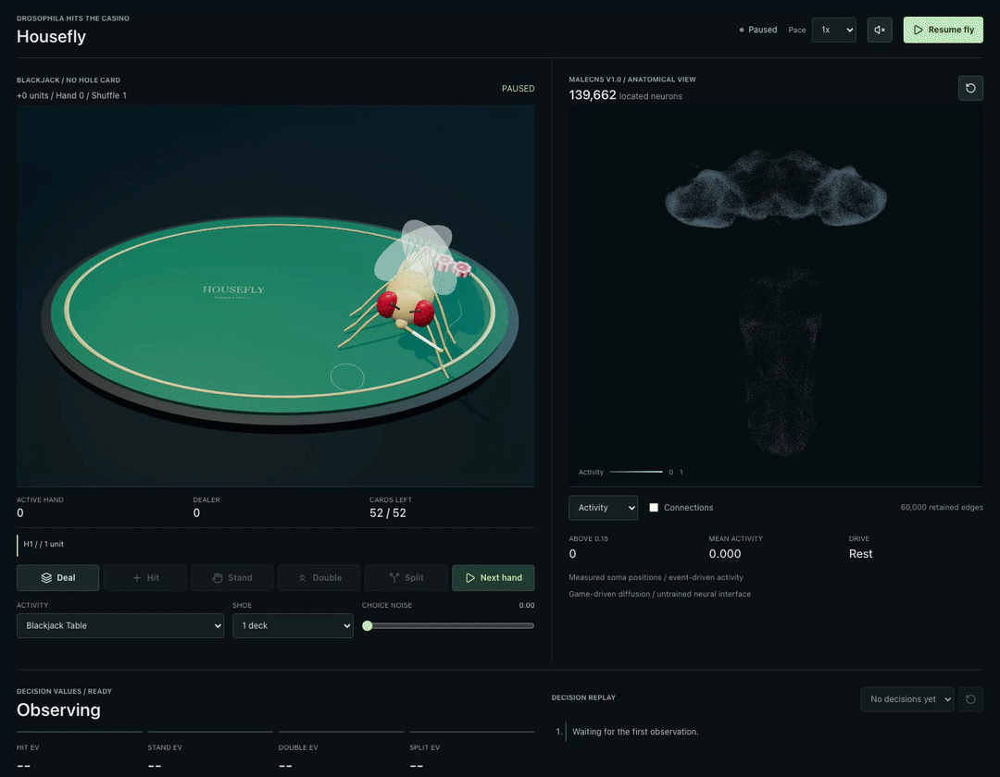
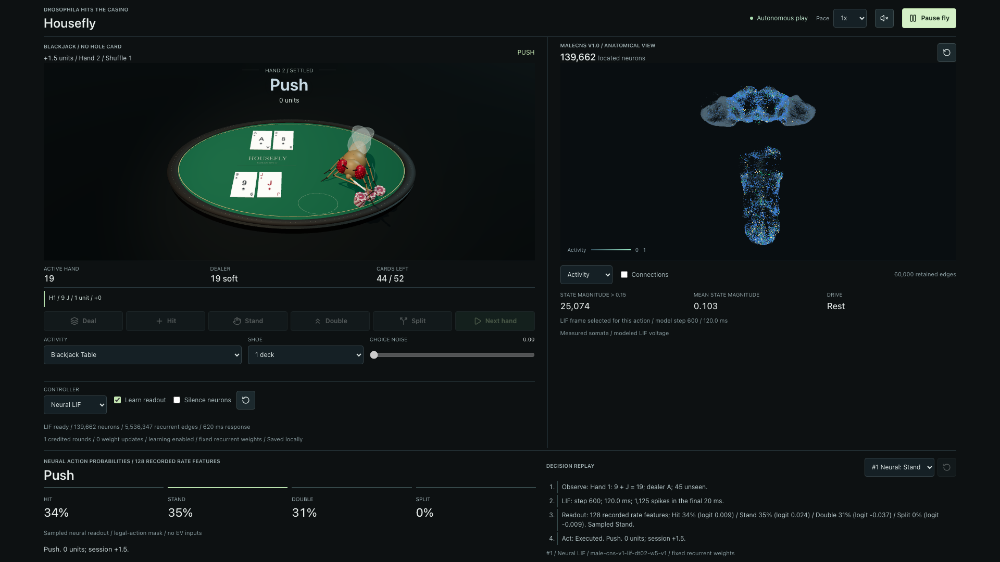
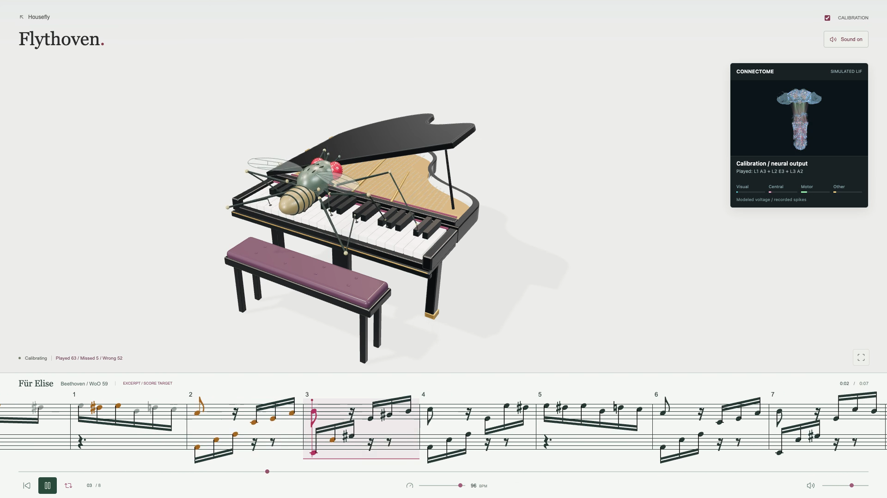
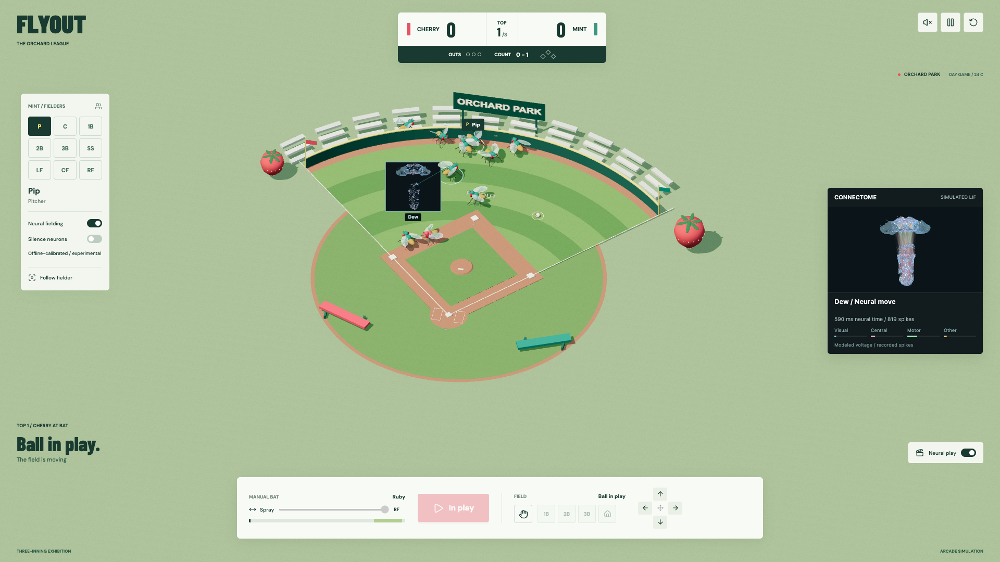
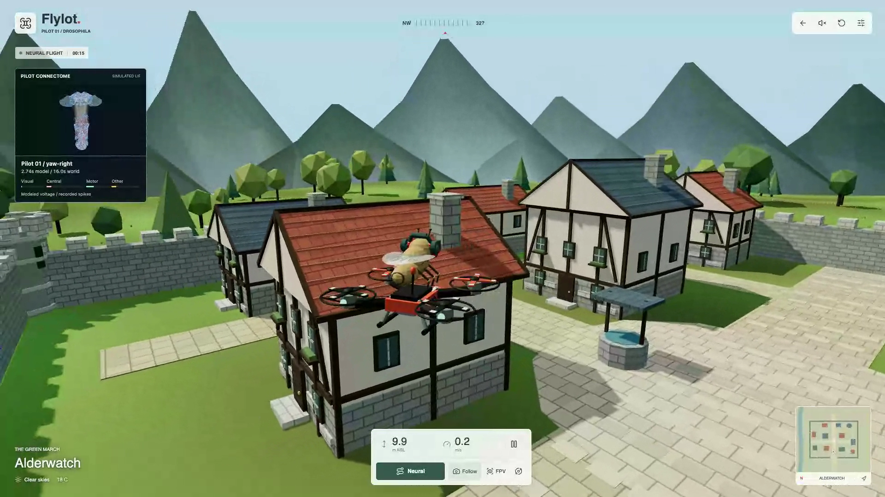

# Housefly

**Drosophila hits the casino. Six legs. One cigarette. Absolutely no financial license.**

A home for experimental fly-brain activities: blackjack, piano, baseball and flight. Housefly starts at an autonomous blackjack table with an articulated 3D fly, moving chips, visible decisions and a live anatomical connectome view. Hit, stand, double, split, celebrate, repeat.



**Experimental neural control, not validated fly cognition.** The local neural mode runs a threshold-pruned MaleCNS LIF model with 139,662 neurons and 5,536,347 recurrent edges. An engineered, trainable readout selects actions from simulated firing rates. The explicit odds baseline still uses mathematical expected values and illustrative activity. The GIF above predates neural control.

## Simulation Showcase

Click a preview to open its neural-controller recording.

| Housefly: Blackjack | Flythoven: Piano |
| --- | --- |
| [](docs/media/housefly-neural.mp4) | [](docs/media/flythoven-neural.mp4) |
| Flyout: Baseball | Flylot: Flight |
| [](docs/media/flyout-neural.mp4) | [](docs/media/flylot-neural.mp4) |

These are experimental captures, including missed notes and imperfect movement.
The Flythoven clip is an older 96 BPM calibration recording, not the current
72 BPM encoder or a polished performance. The overlays show modeled activity,
not a measurement of a living fly's thoughts.

## Run

Node.js 24+. No API keys or Python service needed to run the browser apps. The local checkout includes anatomical assets and about 46 MB of neural runtime/graph assets; neural mode loads those separately. See [neural reproduction](neural/README.md) for source data, assumptions, and rebuilding.

```bash
npm ci
npm run dev -- --port 5173
```

Open **http://127.0.0.1:5173**. Autoplay is on; sound is opt-in. Pause for manual play and replay. Use `/?seed=5` for the recorded sequence, or `/?autoplay=0&seed=5` to start paused. Deck changes apply between hands.

Remote workstation:

```bash
ssh -N -L 5173:127.0.0.1:5173 <user>@<host>
```

## Architecture

- TypeScript + Three.js: table, procedural textures, gestures, chips, measured anatomy.
- Neural Web Worker: Rust/WASM LIF integration; engineered sensory input and a trainable output policy. The recurrent graph is fixed, and simulated activity is not measured biological activity.
- Explicit odds baseline: exact finite-shoe Hit/Stand/Double EV; split-round choices use 16,000 coupled rollouts per action. Estimates are labeled.
- One shuffled deck by default, configurable to eight. S17, no hole card, 3:2 naturals, double after split, maximum two hands; dealer natural takes all stakes.
- Python + Polars: optional data download/export tools, with source hashes and selections in [the manifest](public/connectome/manifest.json). These are structural connections, not trained policy weights.

[Architecture, rules, state/action space, and data reproduction](docs/architecture.md) | [Neural-controller roadmap](docs/neural-roadmap.md)

The activity selector also links to Flythoven, Flyout, and Flylot. Their experimental neural versions map score targets, game observations, or flight observations into the shared neural runtime and decode its outputs into actions. Interfaces and actuators are engineered, performance is limited, and no biological task competence is claimed. Older videos used separate score/game/flight controllers. A general prompt-to-environment engine remains future work.

Neural overlays display actual modeled voltages and spikes. Baseline Input, Process, Motor, and Outcome channels remain illustrative display mappings, not identified task circuits. [Prior work and claim boundaries](docs/neural-control-priors.md) | [Overlay architecture](docs/activity-overlay.md) | [Blackjack odds-policy audit](docs/blackjack-policy-audit.md).

## Verify And Record

```bash
npm test
npm run build
npx playwright install chromium
npm run test:ui -- tests/browser/table.spec.ts
```

With the dev server running and `ffmpeg` installed, `npm run record:demo` records actual seeded autoplay through a win to `docs/media/`. The GIF and MP4 are silent; live sound effects are locally synthesized. No game outcomes are overridden for the recording.

[Flythoven MP4 with synthesized piano audio](docs/media/flythoven.mp4) | [Flyout gameplay MP4, silent](docs/media/flyout.mp4) | [Flylot flight MP4, silent](docs/media/flylot.mp4).
Regenerate using `npm run record:piano`, `npm run record:flyout`, or `npm run record:flypv`.

## Activities

Each activity uses the shared browser runtime with its own state, action space,
sensory encoding and actuator. Add new experiments without depending on a gallery,
social API, deployment service or private credential.
Flythoven's target is the opening theme of Beethoven's *Fur Elise*, using
[Mutopia's public-domain edition](https://www.mutopiaproject.org/cgibin/piece-info.cgi?id=931),
with scrolling grand-staff notation. Neural mode's audio follows actual key
contacts, including wrong or late notes; it is not a guaranteed rendition.

## Credits

Data: [HHMI Janelia MaleCNS v1.0](https://male-cns.janelia.org/download/), CC-BY, with credit to the release's collaborators. [Google Research milestone](https://research.google/blog/a-connectomics-milestone-mapping-the-complete-male-fruit-fly-brain/).

Created by [@msxndborn](https://x.com/msxndborn). GitHub: `sandbornm`.

**Post caption:** "Drosophila hits the casino. Six legs, a cigarette, and 139,662 simulated neurons. Experimental neural control, questionable table manners. Meet Housefly."
