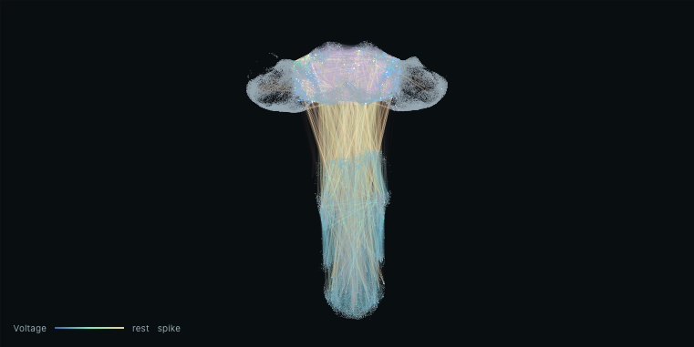
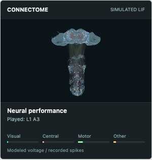
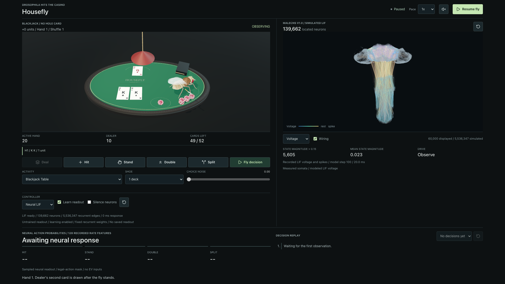
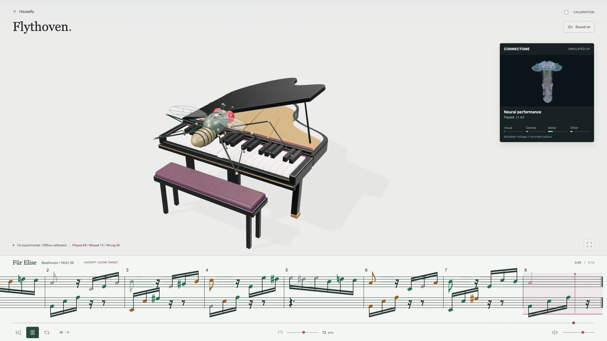
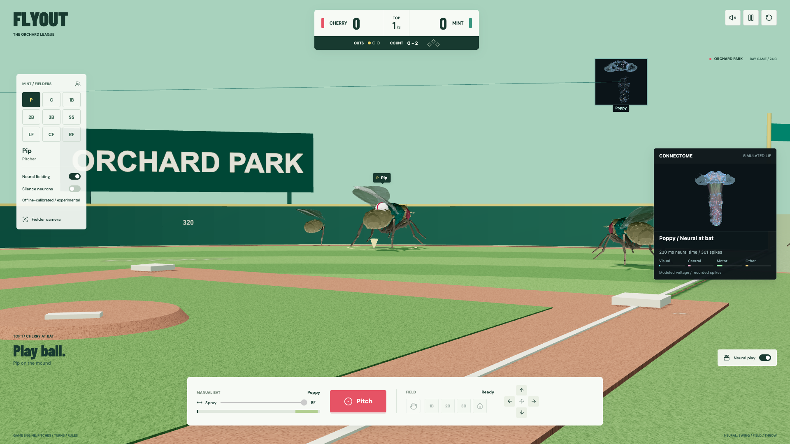
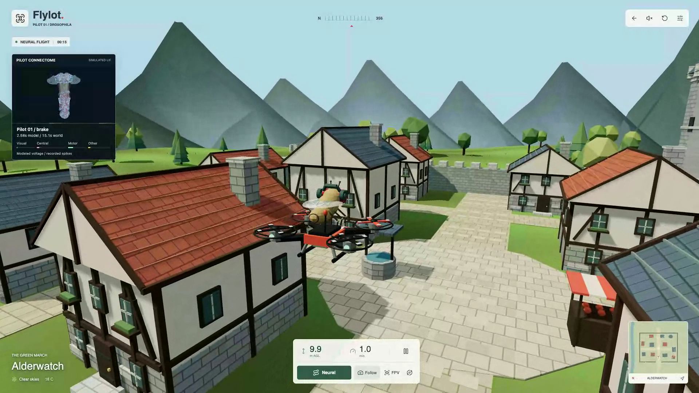

# Housefly

A shared MaleCNS LIF runtime plus small activity adapters. Each scene maps its
own observations to 32 sensory rates, steps the same frozen connectome graph,
and reads actions from 128 pool rates. Blackjack is the landing page. Piano,
baseball, flight, and a garden escape live under `/simulations/`.

Experimental neural control, not validated fly cognition. No API keys.



The inspector shows 139,662 located neurons. Wiring in the panel is a 60,000-edge
display subset; the controller integrates all 5,536,347 retained edges. Color is
modeled membrane voltage (blue below rest, gold on a spike in this step).

## Start

Node.js 24+. Clone, install, run:

```bash
git clone https://github.com/sandbornm/housefly.git
cd housefly
npm ci
npm run dev -- --port 5173
```

Open **http://127.0.0.1:5173**. Neural mode loads about 46 MB of local assets.

| Path | Activity |
| --- | --- |
| `/` | Housefly — blackjack |
| `/simulations/piano/` | Flythoven — piano |
| `/simulations/flyout/` | Flyout — baseball |
| `/simulations/flypv/` | Flylot — flight |
| `/simulations/flysim/` | Fly Simulator — garden escape |

Agents: [AGENTS.md](AGENTS.md) and [adding a task](docs/neural-tasks.md).

## How an adapter works

```text
world observation
        │
        ▼
  encode() → 32 rates, 0..150 Hz
        │
        ▼
  WASM LIF  (fixed MaleCNS graph, 0.2 ms ticks)
        │
        ▼
  frame: voltages, spikes, 128 pool rates
        │
        ├── overlay copies this frame (no invented spikes)
        ▼
  readout.decide(rates, legal mask) → action
        │
        ▼
  environment applies the action
        │
        ▼
  teach / reinforce on the readout only
```

The recurrent weights stay frozen. Task learning is a linear readout on the 128
measured rates (`teach` for labeled rehearsal, `reinforce` for sampled executed
actions). `encode()` must not include a teacher action. Silence, zero rates, or
missing assets withhold motors; there is no scripted fallback.

Blackjack uses the generic `NeuralTaskController` in `src/neural/task.ts`.
Piano, Flyout, Flylot, and Fly Simulator reuse `integrateNeuralWindow` with
task-specific heads. Scaffold a stub with:

```bash
npm run scaffold:activity -- --id odor-trail --title "Odor Trail"
```

Then register the page in `src/activityCatalog.ts` and `vite.config.ts`. The
scaffold does not create a world.



Overlays construct `ActivityConnectome` with `neural: true`. They stay dark
until a real frame arrives, then `updateNeural` copies voltages and spike
indices. Event-projection is not the control path.

## Recordings

Click a still to open the neural-controller take. Missed notes and early swings stay in.

| Blackjack | Flythoven |
| --- | --- |
| [](docs/media/housefly-neural.mp4) | [](docs/media/flythoven-neural-current.mp4) |
| Flyout | Flylot |
| [](docs/media/flyout-neural-current.mp4) | [](docs/media/flylot-neural-current.mp4) |

Older files without `-neural` in the name used non-neural controllers.

Blackjack also ships an explicit odds baseline (exact finite-shoe Hit/Stand/Double
EV; split estimates labeled). Neural mode samples the readout, not those EVs.

## Run and record

```bash
npm test
npm run build
npx playwright install chromium
npm run test:ui -- tests/browser/table.spec.ts
```

With the dev server up and `ffmpeg` installed:

```bash
npm run record:demo
npm run record:piano
npm run record:flyout
npm run record:flypv
```

`/?seed=5` is the recorded blackjack sequence. `/?autoplay=0&seed=5` starts paused.

## Layout

- `src/neural/` graph loader, WASM worker, readout, task controller — no game, no credentials
- `src/` blackjack table and the large connectome inspector
- `simulations/{piano,flyout,flypv,flysim}/` activity worlds
- `public/neural/` and `public/connectome/` runtime binaries (Janelia CC-BY)
- `public/models/drosophila.glb` NeuroMechFly v2 body (Apache-2.0)

[Architecture](docs/architecture.md) · [Task adapter contract](docs/neural-tasks.md) · [Claim boundaries](docs/neural-control-priors.md) · [Overlay](docs/activity-overlay.md)

## Credits

Data: [HHMI Janelia MaleCNS v1.0](https://male-cns.janelia.org/download/), CC-BY.
[Google Research milestone](https://research.google/blog/a-connectomics-milestone-mapping-the-complete-male-fruit-fly-brain/).

Body mesh: [NeuroMechFly v2](https://neuromechfly.org/) (Ramdya lab, EPFL), Apache-2.0.
[Wang-Chen et al., Nature Methods 2024](https://doi.org/10.1038/s41592-024-02497-y).

Created by [@msxndborn](https://x.com/msxndborn). Source: [github.com/sandbornm/housefly](https://github.com/sandbornm/housefly).
Original code is MIT; connectome data is Janelia CC-BY; body mesh is NeuroMechFly Apache-2.0. See [LICENSE](LICENSE).
