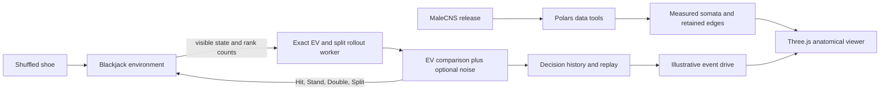

# Housefly Technical Notes

An autonomous 3D fruit fly at a blackjack table, alongside a navigable MaleCNS anatomical point cloud. The fly has a cigarette and distinct Hit, Stand, Double, and Split gestures. It plays continuously by default.

**Current controller: mathematical policy. Anatomy and displayed edges: real MaleCNS data. Activity: illustrative event-driven diffusion.** The view contains 139,662 classified neurons with measured soma coordinates and a 60,000-edge subset of the measured graph. This is not a trained neural blackjack controller or a calibrated spiking simulation.

## Run

Node 24+ is used for the TypeScript tests.

```bash
npm install
npm run dev -- --port 5173
```

Open http://127.0.0.1:5173. For a remote workstation:

```bash
ssh -N -L 5173:127.0.0.1:5173 <user>@<host>
```

Pause/resume the fly and change pace, deck count, choice noise, or anatomical display settings. Deck changes during play apply between hands, preserving the session score. A reproducible paused run is available at `http://127.0.0.1:5173/?autoplay=0&seed=5`. Game randomness and policy noise use separate seeded streams; rendering does not consume either stream.

The browser runs odds in a Web Worker; Python is optional. Start the data service with `npm run serve` for `/api/health` and `/api/connectome`. Vite proxies these requests to port 8787. The old Python `/api/odds` endpoint returns HTTP 410: keeping one solver prevents divergent rules and duplicate computation.

## Blackjack

The default is one Fisher-Yates-shuffled 52-card deck, with real faces and suits. Configure 1, 2, 4, 6, or 8 decks. The shoe persists across rounds; it reshuffles before a round at 25% remaining, or earlier when the low-card reserve cannot cover two split hands plus the dealer. A deck-count change creates a fresh shoe between rounds.

Rules are European no-hole-card, dealer stands on soft 17, blackjack pays 3:2, and the initial wager is one unit. Double is allowed on any two-card hand, including after splitting, and forces one card followed by a stand. Equal-value pairs can split into two hands, played sequentially against one dealer; resplitting is disabled. Split aces get one card each. A 21 after splitting pays 1:1, not a natural. Dealer blackjack wins all outstanding stakes, including doubled and split stakes. Surrender, insurance, and variable initial wagers are not implemented.

The policy sees public cards, hand statuses/stakes, dealer upcard, and ten unseen rank counts. It never receives deck order. Single-hand Hit/Stand/Double values are exact finite-shoe EV; Hit includes optimal future Hit/Stand choices. Split EV and all decisions during split rounds use 16,000 deterministic Monte Carlo rollouts per action, sharing the finite shoe and one dealer across both hands. Their continuation policy optimizes a frozen-composition approximation. Displayed 95% sampling intervals exclude approximation error in that continuation policy. The UI marks estimates with `~` and names the estimation method.

Choice noise defaults to zero and changes only action selection. The trace retains pre-action observations, action values, sampled noise, and results. Replaying a decision animates its gesture and event drive without playing another move. Pausing cancels a pending decision before its next card draw.

## Connectome Data

[HHMI Janelia's MaleCNS v1.0 release](https://male-cns.janelia.org/download/) supplies structural connection strengths, annotations, and neurotransmitter predictions. These are not trained blackjack policy weights. The [Google Research announcement](https://research.google/blog/a-connectomics-milestone-mapping-the-complete-male-fruit-fly-brain/) describes the mapping milestone.

```bash
python3 -m venv .venv
.venv/bin/pip install -r requirements.txt
npm run download:annotations
npm run download:connectome
.venv/bin/python scripts/build_connectome_seed.py
.venv/bin/python scripts/build_connectome_view.py
```

Downloads go in ignored `data/raw/`. Completed transfers have byte counts checked and SHA-256 hashes recorded in `data/raw/manifest.json`. The weights table is 1,051,241,946 bytes. The full file has 151,856,684 rows across all segments; that is not a count of proofread neurons or individual synapses. The annotation and neurotransmitter tables add about 58 MB.

The Polars view exporter retains classified bodies with `somaLocation` and the strongest 60,000 connections (weight >= 5) whose endpoints have coordinates. Browser assets total about 3.1 MB in `public/connectome/`; their manifest pins inputs, selection, axes, sizes, and hashes. Coordinates are uniformly normalized, not generated. Optional edges are straight soma-to-soma links, not axonal morphology. The full 1.1 GB raw graph is not shipped to the browser. MaleCNS data is CC-BY; attribution remains with HHMI Janelia and the collaborating institutions listed on the download page.

The activity display updates a bounded positive diffusion process over the retained edges. Task phases inject drive into named neuron classes, with weights log-scaled and normalized by incoming total. These are dimensionless visualization values, not firing rates or membrane voltages. Edge selection omits most connectivity and neurotransmitter effects; this process does not decide game actions.

## Architecture



- `src/activities/blackjack.ts`: state transitions, cards, rewards, action selection.
- `src/activities/blackjackOdds.ts`: shared, memoized finite-shoe solver.
- `src/activities/blackjackRollout.ts`: coupled multi-hand rollout estimates.
- `src/activities/blackjack.worker.ts`: asynchronous odds boundary.
- `src/main.ts`: autoplay, settings, pre-action snapshots, replay.
- `src/casinoScene.ts`: 3D table, fly, gestures, animated cards.
- `src/connectomeView.ts`: measured point cloud, edge display, event-driven diffusion.
- `src/activityCatalog.ts`: activity metadata. Only blackjack runs today.
- `backend/server.py`: optional local data/provenance service.

`npm run scaffold:activity -- --id odor-trail --title "Odor Trail"` creates metadata only. Additional activities still need an environment, observation encoder, actions, policy, and renderer integration. A prompt-to-environment system and shared neural runtime are future work.

See [the neural integration roadmap](neural-roadmap.md) for the missing dynamics and training.

## Verification

```bash
npm test
npm run build
npx playwright install chromium
npm run test:ui
```

Tests cover card conservation, soft aces, natural/double/split payouts, exact EV comparison, deterministic rollout cases, uninterrupted autoplay, pause, deferred settings, gestures, replay, and desktop/mobile WebGL framing and motion. Screenshots and traces stay in ignored `test-results/`.
